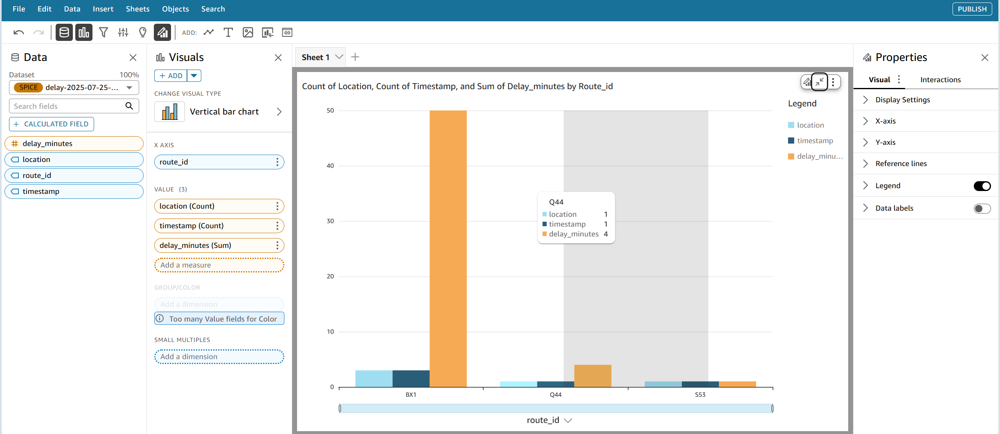

# 🚦 Public Transport Delay Insights System

A city transport monitoring solution that analyzes **bus and train delays** using AWS services. It visualizes real-time and historical delay data to help optimize route planning and improve public service delivery.

---
## 📊 Key Features

- ✅ Real-time dashboard showing **average delays by route and location**
- ⚠️ Automated **alerts** when delays exceed defined thresholds
- 📍 Route optimization insights based on **temporal and spatial trends**
- 🔎 Query processing via **Amazon Athena**
- 📈 Visualization through **Amazon QuickSight**
- 💾 Dataset from **MTA NYC Transit** and **UK Transport Open Data**

---
## 🧱 Architecture Overview

```plaintext
                         ┌─────────────────────────────┐
                         │      Public Dataset         │
                         │ (MTA/UK Transport Open Data)│
                         └────────────┬────────────────┘
                                      │
                                      ▼
                          ┌──────────────────────┐
                          │    Amazon S3 Bucket  │◄────────────┐
                          └──────────────────────┘             │
                                      │                        │
                                      ▼                        │
                        ┌──────────────────────────────┐       │
                        │  AWS Glue / ETL (optional)   │       │
                        └──────────────────────────────┘       │
                                      │                        │
                                      ▼                        │
                         ┌─────────────────────────────┐       │
                         │       Amazon Athena         │──────►│
                         └─────────────────────────────┘       │
                                      │                        ▼
                         ┌──────────────────────────────┐
                         │     Amazon QuickSight        │───► 📊 Dashboard
                         └──────────────────────────────┘
```

---
## 📍 Dashboard Diagram

Example QuickSight dashboard visualization:



---
## 📦 Folder Structure

```plaintext
transport-delay-dashboard/
├── .github/
│   └── workflows/
│       └── deploy.yaml           # GitHub Actions for CI/CD deployment
├── lambda/
│   └── process_delay.py          # Lambda function to process delay data
├── cloudformation/
│   └── template.yaml             # Infrastructure-as-Code (IaC) setup
├── quicksight/
│   └── visualboard.png           # Dashboard mockup
├── athena/
│   └── queries.sql               # SQL queries for insights
├── README.md
```
---
## 🚨 Delay Alerts

A **Lambda function** is triggered by **Amazon EventBridge** when delay for any route exceeds a set threshold (e.g., >15 minutes). This enables real-time operational response and escalation.

---
## 🔧 Deployment Notes

- Upload your JSON delay data to **S3** (`/processed/` folder)
- Athena queries the data directly from S3
- QuickSight dashboards are refreshed on data upload or scheduled basis
- Delay alerts are triggered via **Lambda + EventBridge**

---
## 📁 Dataset Source

- **MTA NYC Transit GTFS Data**
- **UK Transport Open Data**

